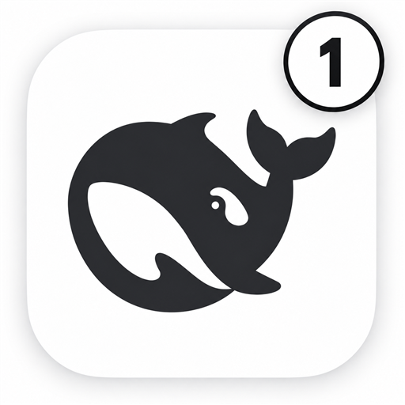

<div align="center">
  
  <h1>Attention Notifier</h1>
  <p><b>Plugin for DeepSeek Harness · DeepSeek Harness 插件</b></p>
  <p><i>You hear it the moment a task finishes — or waits for you.<br/>任务完成的时刻、等你的时刻，你都会听见。</i></p>
  <p>
    <a href="#english">English</a> · <a href="#中文">简体中文</a>
  </p>
  <p>
    <a href="https://github.com/ahian-lee/dsh-attention-notifier/releases/latest"></a>
    <a href="LICENSE"></a>
    <a href="https://github.com/dsh-market/dsh-market"></a>
    
  </p>
</div>

> Unofficial community plugin · 非官方社区插件

---

## English

A [DeepSeek Harness](https://github.com/deepseek-ai/deepseek-harness) plugin for the way you actually work: send DSH a task, switch to another app, and let the plugin tell you the two moments that matter — **a task finished**, or **DSH needs you** (approval or an answer).

### ✨ Features

|  | English | 中文 |
|---|---|---|
| 🔔 | **Two moments, two sounds** — a calm double chime when a task completes, an urgent triple tone when a session waits for your approval, or the agent asks you a question mid-task (`ask_user_question`, both timed and blocking forms) | **两种时刻，两种声音** — 完成两声舒缓，等人处理三声急促；agent 任务中途提问求助（批准、`ask_user_question` 提问）同样响 |
| 🎛 | **Change sounds in Settings** — More → Settings → plugins → Attention Notifier: four synth styles per event, preview button, or pick any audio file of your own (≤5MB, survives restarts) | **设置里换提示音** — 每个时刻独立选择：4 种合成音色、试听、或直接选你自己的音乐文件 |
| 🐱 | **Built-in cat hachimi sounds** — Blue Lotus / North South / Mambo on completion, Neige / Electric Neige when it waits for you. Just for fun | **内置猫咪 hachimi 音效**，just for fun |
| 🔢 | **Windows taskbar digit** (optional patch) — a plain white-disc digit with the number of sessions waiting, plus taskbar flashing; the digit stays until you return to the window | **任务栏数字角标**（可选补丁）+ 闪烁；回到窗口自动清除 |
| 🧾 | **Native toasts** — background notifications via the patched app's native channel (or standard notifications without the patch); clicking one focuses the window | **原生系统通知**，点击唤起窗口 |
| 🧩 | **Official settings slot** — the settings card lives on DSH's real plugins page; no floating widgets anywhere | **官方设置页槽位**，界面无任何悬浮元素 |

### 📦 Install

```sh
dsh plugin --profile desktop add github:ahian-lee/dsh-attention-notifier
```

Fully quit DeepSeek Harness Desktop first (the desktop profile belongs to the app), run the command, then start the app again. Click once inside the DSH window so audio playback is allowed to start.

Or install from inside the app: the **Plugins** page (sidebar) → **Add plugin**, and paste `github:ahian-lee/dsh-attention-notifier`.

### 🎛 Sound settings

Open **More → Settings → plugins → Attention Notifier**:

- "When waiting for you" and "When a task finishes" are configured independently.
- Pick one of four synthesized styles (Classic / Soft / Retro / Bell) — clicking plays a preview.
- Or press **Choose music…** and select any audio file on your computer (≤5MB). It is stored in the browser database and kept across restarts.
- The card summary shows what each moment currently plays.

### 🔢 Windows overlay patch (optional)

Sound and notifications work without it. The optional patch adds the taskbar digit, flashing and native toasts by extending the local desktop app (white-disc, black-digit, one simple style for every state). It is a local shadow-app patch, fully revertible, and documented in [overlay/README.md](overlay/README.md). **Revert it before updating DSH**, re-apply afterwards.

### 🔍 How it works (for reviewers)

The host half publishes an `attention` session projection (waiting-approval / waiting-answer / done, with turn identity). The client half subscribes to it (polling fallback), detects meaningful transitions with dedupe and a burst-aggregation window, then plays a WebAudio tone (or your chosen audio), sends a notification, and — when the desktop app carries the optional patch — drives the taskbar digit through a small `window.dshAttentionLocal` bridge added by that patch. User audio goes to IndexedDB, preferences to `localStorage`. No data leaves the machine.

### 🗑 Uninstall

Remove the plugin from the Plugin Manager; if you installed the patch, run `overlay/restore-attention-overlay`.

---

## 中文

一个 [DeepSeek Harness](https://github.com/deepseek-ai/deepseek-harness) 插件，配合你真实的工作方式：把任务交给 DSH，切去别的应用，插件只负责告诉你两个最重要的时刻——**任务完成了**，或者**DSH 在等你**（批准或回答）。

### ✨ 特色

|  | 功能 | 说明 |
|---|---|---|
| 🔔 | **两种时刻，两种声音** | 任务完成两声舒缓提示音；等待批准、或 agent 中途向你提问求助（`ask_user_question`，定时/阻塞两种形态都算）三声较急促，绝不会听混 |
| 🎛 | **设置里自由换提示音** | 更多 → 设置 → 插件 → Attention Notifier：每个时刻独立选择，4 种合成音色 + 试听，或直接选你自己电脑上的任何音频（≤5MB，重启不丢） |
| 🐱 | **内置猫咪 hachimi 音效** | 完成 = Blue Lotus / North South / Mambo；等你处理 = Neige / Electric Neige。just for fun |
| 🔢 | **任务栏数字角标**（可选补丁） | 白底黑字，数字=有几个会话在等你；任务栏闪烁；回到窗口自动清除 |
| 🧾 | **原生系统通知** | 装补丁后走系统原生通知，点击唤起 DSH 窗口；不装补丁用标准通知 |
| 🧩 | **官方设置页槽位** | 设置界面长在 DSH 真正的设置页里，界面上没有任何悬浮元素 |

### 📦 安装

```sh
dsh plugin --profile desktop add github:ahian-lee/dsh-attention-notifier
```

先完全退出 DeepSeek Harness Desktop（desktop profile 属于应用本身），执行命令后再打开应用。然后在 DSH 窗口里点一次，允许音频播放。

也可以在应用内安装：侧边栏 **插件** 页 → **添加插件**，粘贴 `github:ahian-lee/dsh-attention-notifier`。

### 🎛 提示音设置

**更多 → 设置 → 插件 → Attention Notifier**：等待处理和任务完成各自独立选音色；"选择音乐…"可以直接用自己电脑上的音频文件当提示音。

### 🔢 Windows 补丁（可选）

不装补丁也有声音和通知。补丁为本地桌面版增加任务栏数字角标、闪烁和原生通知（统一白底黑字，简单一种样式），完全可还原，详见 [overlay/README.md](overlay/README.md)。**更新 DSH 前先还原补丁**，更新后再装回。

### 🔍 实现方式（供评审参考）

宿主侧发布 `attention` 会话投影（等待批准 / 等待回答 / 完成，含轮次标识）；客户端订阅投影（不支持时轮询），带重复去重与突发聚合，然后播放 WebAudio 合成音或你选择的音频、发送系统通知，并在装有可选补丁时通过 `window.dshAttentionLocal` 桥驱动任务栏角标。用户音频存 IndexedDB，偏好存 localStorage，数据不出本机。

### 🗑 卸载

在插件管理器中移除；装过补丁的话运行 `overlay/restore-attention-overlay`。

---

<div align="center">
  <i>Leave the window; the important moment comes to you.<br/>离开窗口也没关系，重要的时刻会自己找你。</i>
</div>

## License / 许可证

[MIT](LICENSE)

本插件在 DSH 官方插件专区的展示与反馈帖：[Discussion #9003](https://github.com/deepseek-ai/deepseek-harness/discussions/9003)。开发、排查问题和投稿信息见[开发说明](docs/development-notes.md)。
